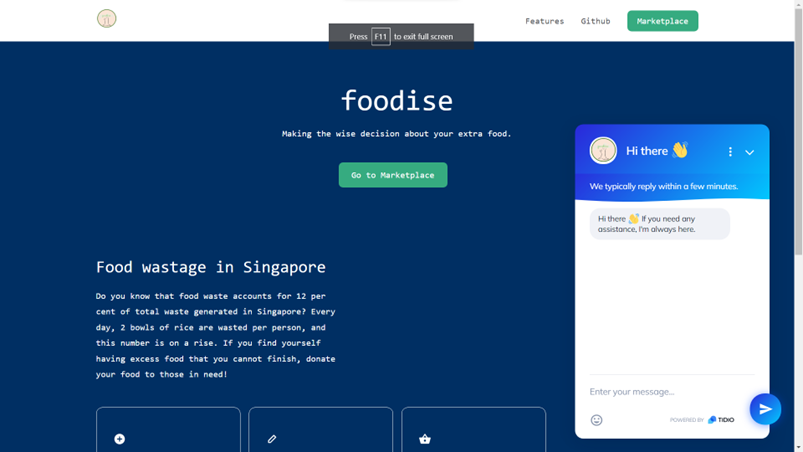

<p align="center">
  <a href="https://foodise.vercel.app">
    
  </a>
  <h1 align="center">foodies</h1>
  <br>



<p align="center">
<b>foodise</b> is a marketplace that attempts to tackle growing food wastage and cut down on unnecessary food wastage. It is developed as part of <a href="https://lifehack.nuscomputing.com/">NUS LifeHack 2022</a>.
</p>

## ⚡️ Quickstart


To view a demo of the marketplace, you can visit our website [here]("https://foodise.vercel.app").

Alternatively, you can install a local version on your system by cloning the project and following the steps below

```sh
git clone https://github.com/nicholasohjj/foodise.git

cd ./<PROJECT_NAME>

npm install
npm start

```

## 🎯 Features

-   Stylised with Atomise UI
- Post and reserve listings of food and drinks you would like to share!
- Connect with like-minded individuals when you reserve a lising
## 💡 Philosophy

In 2019, Singapore generated around 744 million kg of food waste, accounting for 12% of total waste production in Singapore. 

foodise aims to encourage Singaporeans to make the **wise** decision of donating their **surplus food** instead of throwing them away by connecting donors and recipients through a website. By incorporating donations from both individuals and corporates, this allows to minimise the amount of food thrown and go beyond existing solutions.

We **listen** to our users in [issues](https://github.com/nicholasohjj/foodise/issues) _and all over the Internet_ to create a **fast**, **flexible** and **friendly**  platform for all.

## 👀 Tech Stack
- Frontend website is programmed with React and deployed via Vercel.
- Stylised with Atomise UI with authentication and user management provided by Clerk.dev. Atomise handles HTTP requests to the backend.

- Backend is programmed with Express and mongoose, with data collected from listings stored via MongoDB. Backend repository can be found [here]("https://www.github.com/nicholasohjj/foodise-backend")

## ⚠️ Limitations
* Due to time constraints in developing foodise (approximately 24 hours), users may encounter glitches when uploading, deleting, or reserving listings displayed on the marketplace. These issues will not siginificantly impact user experience

                
## 👍 Contribute

If you want to say **thank you** and/or support the active development of `foodise`:

1. Add a [GitHub Star](https://github.com/nicholasohjj/foodise/stargazers) to the project.
2. Tweet about the project [on your Twitter](https://twitter.com/intent/tweet?text=Fiber%20is%20an%20Express%20inspired%20%23web%20%23framework%20built%20on%20top%20of%20Fasthttp%2C%20the%20fastest%20HTTP%20engine%20for%20%23Go.%20Designed%20to%20ease%20things%20up%20for%20%23fast%20development%20with%20zero%20memory%20allocation%20and%20%23performance%20in%20mind%20%F0%9F%9A%80%20https%3A%2F%2Fgithub.com%2Fgofiber%2Ffiber).
3. Write a review or tutorial on [Medium](https://medium.com/), [Dev.to](https://dev.to/) or personal blog.

